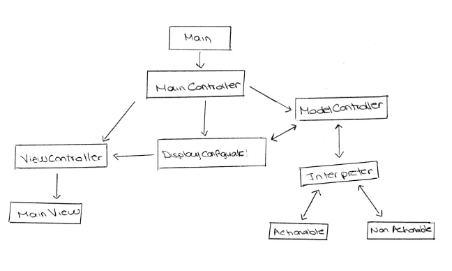
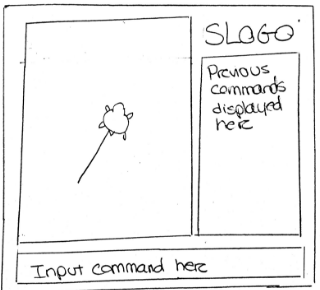

# SLogo Team 18 : Design

### Introduction

In this project we are going to develop an integrated development environment (IDE) that enables the user to run a watered-down version of Logo, where the user inputs commands via a GUI in order to manipulate the “turtle” - a robot that moves around, changes direction, draws lines along the path on which it moves, and changes colors, among its array of other features. 

The turtle will be moved on a per expression basis, which means that it will be able to dynamically interact with the user, based on the commands that the user types in. The commands can be simple one-liners (ex: sum 1 2), but they can also be a combination of multiple commands in a single line (ex: forward 10 back sum 3 5) - which will be broken down into smaller commands, each of which will be handled accordingly.

The program will be mostly closed, in that the only configuration that the user can make is through the commands, which are entered through the GUI. Every other functionality is kept under the hood, in that the user is not exposed to how each command is handled, and how the result of each command is passed onto its graphic representation counterpart. In other words, the program will be closed for modification, in that the user will not be able to toggle any of the inner settings, other than modifying the turtle through commands.

On the other hand, the program will be open to extension, in that we will be actively utilizing the MVC model, where the model - an encapsulation of all of the turtle’s configurations, including position, direction, and color - will be continuously updated by the ModelController (with the help of an Interpreter) and passed along to the ViewController. A central MainController will be in charge of syncing the activities between the Model and the View aspects of the program.


### Design Overview

Here is an image of the design of the project:





The user will input the command into the input box. When the **Enter** key is pressed, an observer receives the information and sends it to the ViewController which calls the ModelController. The information is then passed to the Interpreter. 

MainController, when initialized, will make an instance of the object DisplayConfiguration that contains the next state of the grid. The DisplayConfiguration object will be a **Singleton pattern** which will make sure the value is consistent throughout the whole model at all times. 

The Interpreter will take the string and figure out what the command does. It will then send this information back to the ModelController, the model will then update the next DisplayConfiguration state. 

When the command finishes executing, the ViewController will then be able to access the DisplayConfiguration that contains the changes in the model and will determine what needs to be drawn in the grid. It will inherently have access to the current state to calculate the changes. This will then be passed on to the MainView which will update the display. The erroneous situation will be in the case that the user inputted a command that wasn't legal, this will be detected by the interpreter and let the ViewController know which will display an error in the screen prompting the user of what the problem with the input was.

### User Interface

The main user input available is going to the the input textbox at the bottom of the GUI. In addition, to this the user will be able to see all the commands used in the past on the right hand side of the screen. The user will be able to press any of these commands and they will be executed again.

Here is an image of the user interface:




The errors which the backend will look out for and display will be in one of the following categories: 

**Invalid Input:** Command does not exist (if the string is not a registered command eg. “ketchup 10” )

**Syntax Error:** Values are not what expected (if you call a command and its not followed by what it needs to run eg. “forward potato”)


### API Details 

API roles:

The MainView is front end external
ViewController is front end and internal
Main and ModelController are back end and internal
Main Interpreter is backend and external 
Actionable and nonactionable sub-interpreters are backend internal

**Backend APIs - External**

By definition, most backend features are not exposed to the user. However, due to the nature of this project, we have classified the backend API into external/internal categories as well. External backend APIs will be mainly used to communicate with the frontend aspect of the project, which means that the DisplayConfigurer class, which essentially manages the flow of information from the backend to the frontend, will be mostly composed of external APIs.

Here are the external APIs that will be implemented by the backend:

+ **DisplayConfigurer**
	+ public void updateChanges()
	+ public Model passModel()
+ **Main Interpreter:**
	+ public ModelUpdates interpretCommand(String input)
+ **ModelUpdates:**
	+ public String getStringValues()
	+ public int getIntValues()

+ **BoardConfiguration:** 
	+ public void setValues(String value)
	+ public void setValues(int value)
	+ public String getStringValue()
	+ public int getIntValue()
	
**Backend APIs - Internal**
Most of the backend features will be kept “under the hood,” in that the program user does not need to know about how each command is specifically parsed and handled; at the end of the day, all the user needs to know is how the turtle moves in response to each command.  Therefore, the ModelController class Interpreter class, which handle the bulk of the workload for the backend, will be composed of internal APIs. 

The external API will include a general interpretCommand() function in the Main Interpreter that will the handle implementation with its sub-interpreters. This will return a data object of type ModelUpdates that holds a set of attributes that represent changes to be made to a model. The model controller will then make the translation of those values into actions taken to change the model. This allows the interpreter to be separated from the implementation of the model. 

The basic model object BoardConfiguration will be similar to ModelUpdates in that it will be just a data object which holds values. Ideally, these will be primitive values and not tied to any implementation details, visual or otherwise. The API of this class will be external.

Here are the APIs that will be implemented by the backend:

+ **ModelController:**
	+ public void parseInput(String input)
	+ public void handleOutput(ModelUpdates updates)
	+ public Model handleMotion()
	+ public Model handleRepeatMotion()

+ **Main Interpreter:**
	+ public String getSymbol(String text) 
	+ public boolean match (String text, Pattern regex)
	+ public void checkError(String input)

+ **SubInterpreter (abstract class):**
	+ public ModelUpdates interpret(String input)

+ **ModelUpdates:**
	+ public void setValues(String value)
	+ public void setValues(int value)

+ **BoardConfiguration:** 
	+ public void setValues(String value)
	+ public void setValues(int value)
	+ public String getStringValue()
	+ public int getIntValue()

In addition, there will be multiple edge cases where an exception will have to be thrown. *(Note: These exceptions will not disrupt the program. Appropriate error messages will be displayed to the user.)* Here are the possible edge cases, as well as the type of exception that will be thrown:

+ The most salient example is a command that is not included in any language; for example, "qwbeafuiqewl" or "apple orange bear" are two commands that would not be accepted in any way, because none of the words correspond to the keywords in our Properties file. In this case, an illegal input exception will be thrown.
+ Another exception, and one that's more difficult to catch, is one where the keywords are correct, but they are organized in a way that the interpreter cannot handle. For example, "50 fd" is a command that will throw an error because the correct syntax for moving the turtle 50 pixels forward is "fd 50". In this case, a syntax error exception will be thrown.
+ A much more subtle exception would be one where the command is nested, and while the individual commands seem to make sense, the aggregated command does not. For example, "fd fd 50" is a command that does not make sense, because fd accepts an integer input for the number of steps that the turtle will take, but "fd 50" is not an integer representation according to our model. In this case, our Interpreter will recursively search through the input and throw a syntax error exception.


### API Example Code

Sequence of Code for the given use case: The user types 'fd 50' in the command window, and sees the turtle move in the display window leaving a trail, and the command is added to the environment's history.

```java
    parseInput(); //called by the ModelController 
    interpretSubCommand(); //called by the Interpreter
    checkError(); //called by the Interpreter
    handleMotion(); //called by the Model Controller
    updateChanges(); //called by the DisplayConfigurer
    updateView(); //called by the ViewController
    updateCommandHistory(); //called by the ViewController
```

Sequence of Code (Ray Song): The user types in ‘sadgbjilrg’ in the command window, which calls an illegal input exception and displays a user-friendly message on the window.

```java
    parseInput(); //called by the ModelController
    interpretSubCommand(); //called by the Interpreter
    checkError(); //called by the Interpreter
    throwIllegalErrorException(); //called by the Interpreter
    updateChanges(); //called by the DisplayConfigurer
    updateView(); //called by the ViewController
    displayErrorMessage(); //called by the ViewController
```

### Design Considerations 

We discussed multiple possibilities of how to update the view after the model changes the state. One possibility is simply allowing MainController to manually call an update method on the view after the model is finished updating. This can simply be performed by an order of method call, since our single-threaded program is guaranteed to have finished everything that the backend model needs to perform before the controller can call the following method to update the view. However, this limits the flexibility of our program greatly, because the main controller would need to be modified if for example the view needed to be somehow updated without the backend receiving an input.

For the interpretation of command strings, we decided to split the interpretation of commands into pieces. There will be a main interpreter that acts both as the external interface to which strings are passed. The internal implementation is then carried out by the main interpreter figuring out which sub-interpreter handles the given command. These sub-interpreters will be separated into classes by categories so that adding/removing support for certain types of commands is very easy. For example, to keep the user from changing the environment, you would simply remove the class that holds those types of commands from the main interpreter’s list of sub-interpreters. This process will be recursive, so that the sub-interpreters will handle any single sub-command, and the main interpreter will coordinate passing the next piece of the command to its appropriate interpreter.

We discussed at length how to store our data. We decided to have a basic object that represents the state of the board, and a singleton implementation that allows the most-updated state to be easily accessible and to avoid duplication of data. This presents the challenge that the ViewController must be able to also know the most recent state for certain attributes. For example, when the turtle moves, if the pen is down we will need to know both where the turtle should end up and where it started. For this, we decided to simply store those relevant attributes in the ViewController because they represent the current status of the view. Later, if we need to track changes (like a timeline), we can implement a separate class that adheres to the observer-observable protocol and stores states as they are changed.


### Team Responsibilities

+ **Lucia Martos, Eric Song: frontend development**
	+ Lucia Martos: Will work on MainView development for front-end UI, and assist in ViewController to interface with the back end.
	+ Eric Song: Will work on ViewController to interface with the back end, and assist in MainView development for front-end UI.

+ **Andrew Bihl, Ray Song : backend development**
	+ Andrew Bihl: Representation and updating of data in the model, delegation of error messages, observer-observable implementation, and ModelController.
	+ Ray Song: Will work on incorporating regex expressions into Interpreter class, as well as recursive search of input to correctly parse each input.


